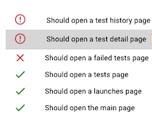
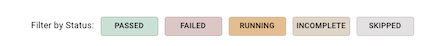

# Features

This section is dedicated to the features we have on Delta Reporter, to help devs and QAs debug their test failures faster!

## Info section

Info section contains the most important information about your failed test. You can check out the full path to the test, error logs, duration, screenshot and video of the test failing!

## Resolution section

This is a handy tool to put a resolution badge on your tests. So that next time you view test results, you can quickly identify what's the issue without even checking the error message.
Also it's useful, when you check same test results with your colleagues, so they know you've already identified the issue.

## Test History section

This tab contains historical information about this test: status, date, resolution if amy.

## FLaky badge

Another handy feature is this little flaky icon 
, that appears, if the test failed more than 5 out of 10 latest runs. This helps tester to quickly spot that the test might need to be looked at.

## Filtering by test status

This top bar on the report allows you to filter tests by status. Normally, a tester would be interested in failed tests first, so you can filter out all other tests and leave just the failed ones to view. Same with skipped, for example. It can be beneficial to go and review skipped tests list once in a while to evaluate, why exactly you have commented them out once.

## Realtime updates

The test report page is updated in realtime. This can be useful in the situations, where you can't wait until the job finishes, you need to react now. For example, when you expect some test failures on release pipeline, this is a great way to view and fix them even before the job is over.

## Smart Links

You can create custom links on Delta Reporter, which can be really useful to integrate with any third-party tools you use for your testing. To name a few examples: 

- Logs from the system under test (like Kibana)
- A link back to the CI/CD job that started the test run (like Jenkins, Azure Pipelines, Travis)
- Bug management tools (like Bugzilla, JIRA)
- Any other external application

In order to add a custom button to the test report, first go to your project options:

This will open a modal window where you can create your useful links for the project selected

The useful links could be displayed in two places on the report: Test Run View (if the tool is related to the whole run, say CI job link, that's global for this particular run) or Test View (if the tool is specific to each test, say link to the logs with the time range specific, to when this particular test was run)

Besides selecting a location for the new link, you can also set a regular expression, which is going to be compared with the environment under test, when this is activated, the link will only be displayed in the environment that matched it, so feel free to set different links for different testing environments

Its possible to enrich a link with data from Delta Reporter, this way you could send ids, timestamps, and other data to other systems with just one click, to include fields into a link, just write the name of the field you want and surround it with curly brackets

    https://foo.bar/{<field_name>}

The availability of the fields you can pass into it will depend on the location:

#### Test Run

    id
    start_datetime
    test_type
    test_run_status_id
    launch_id
    end_datetime
    environment

#### Test

    id
    retries
    test_suite_history_id
    start_datetime
    end_datetime
    mother_test_id
    message
    test_status_id
    error_type
    test_resolution_id
    test_run_id

It's also possible to send custom data back to Delta Reporter, please check the plugin for your framework for details.

### Useful links examples

Based on the screenshot above, we can see 4 links with the following usage:

- First: Link to a Jenkins Job that launches the tests, the link uses custom data sent by the client plugin, in this case the value for the link is:

        {jenkins_url}

- Second: Link to a external tool for Visual Regression testing, the link uses custom data sent the client plugin, in this case the value for the link is:

        {spectre_test_run_url}?status=fail

- Third: Link an external tool to create a bug related to this failed tests, the link uses the test id in order to have a back reference, in this case the value for the link is:

        <tool_url>?test={id}

- Fourth: Link to Kibana to access logs for the system under test, the link uses the time in the test to filter the logs in the range were the test was running, in this case the value for the link is:

        <kibana_url>/discover?_g=(time:(from:'{start_datetime}',mode:absolute,to:'{end_datetime}'))
